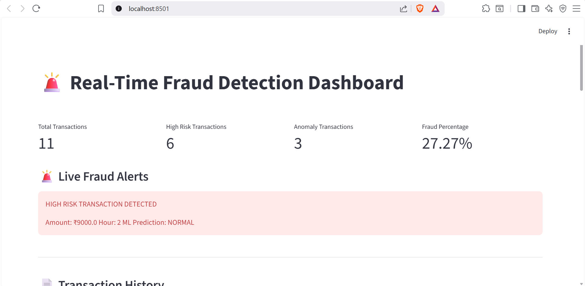
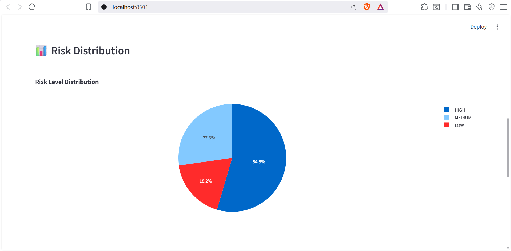
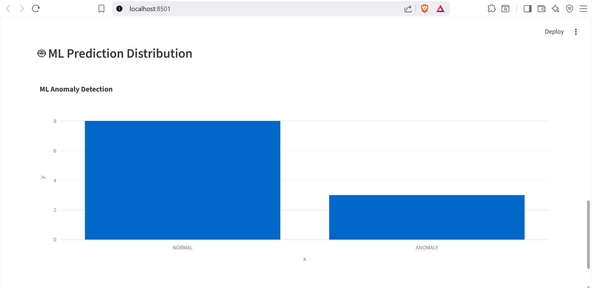
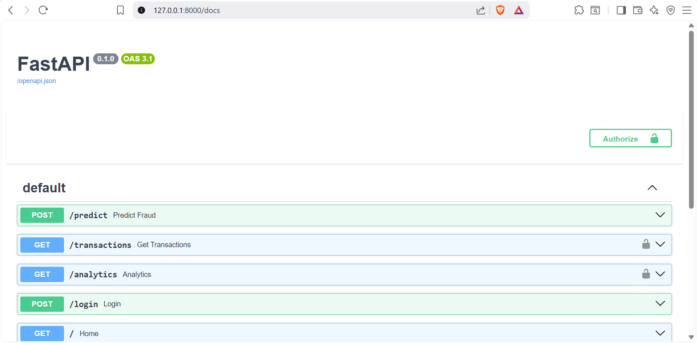
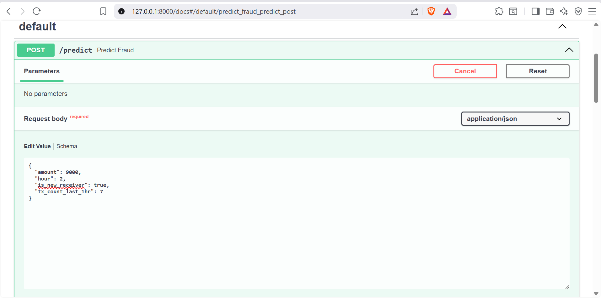
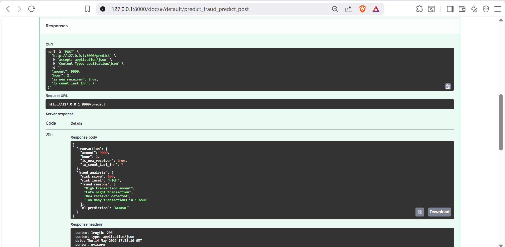
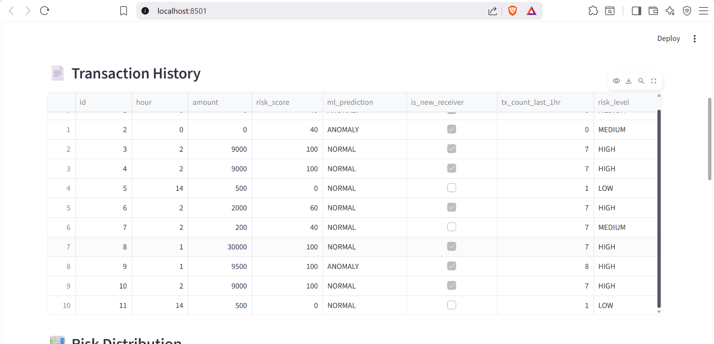

# AI-Powered Fraud Detection & Monitoring Platform

## Overview
A real-time fraud detection and monitoring platform built using FastAPI, Streamlit, SQLite, and Machine Learning.

The system detects suspicious financial transactions using:
- Rule-based fraud analysis
- Isolation Forest anomaly detection
- Risk scoring engine
- Real-time monitoring dashboard

---

## Features

- Real-time fraud prediction
- Machine learning anomaly detection
- JWT authentication
- Protected REST APIs
- Fraud analytics dashboard
- Live fraud alerts
- Transaction history monitoring
- SQLite database integration
- FastAPI backend architecture

---

## Tech Stack

### Backend
- FastAPI
- SQLAlchemy
- JWT Authentication

### Machine Learning
- Scikit-learn
- Isolation Forest
- Pandas

### Dashboard
- Streamlit
- Plotly

### Database
- SQLite

---

## Project Architecture

Client → FastAPI → Fraud Engine → ML Model → Database → Dashboard

---

## APIs

### Authentication
- POST /login

### Fraud Detection
- POST /predict

### Analytics
- GET /transactions
- GET /analytics

---

## Installation

```bash
pip install -r requirements.txt
```

Run backend:

```bash
uvicorn backend.main:app --reload
```

Run dashboard:

```bash
streamlit run dashboard/app.py
```

---

## Future Improvements

- PostgreSQL integration
- Docker support
- AWS deployment
- Role-based access control
- Email fraud alerts

---

## Screenshots

### Dashboard Home



---

### Analytics Pie Chart



---

### Analytics Bar Chart



---

### Swagger Home



---

### Swagger Predict API



---

### Swagger Predict API Output



---

### Transaction History



## Author

Prakash Shrijal